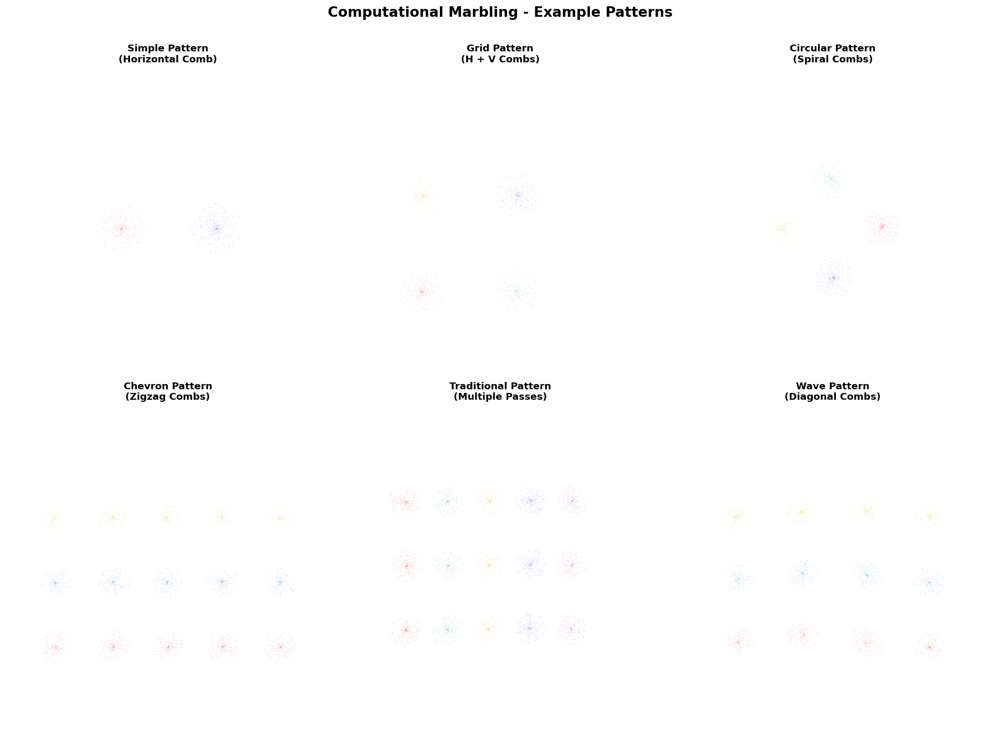

# ComputationalMarbling

Software for computational fluid dynamics to generate traditional marbling art.

## Overview

This software uses computational fluid dynamics (CFD) to simulate the traditional art of paper marbling. It implements the Navier-Stokes equations to model fluid flow and provides both Eulerian (grid-based) and Lagrangian (particle-based) descriptions of the fluid dynamics.



### Features

- **2D Navier-Stokes Solver**: Incompressible fluid simulation using finite differences
- **Eulerian Description**: Grid-based velocity field representation
- **Lagrangian Description**: Particle-based dye tracking that follows the fluid flow
- **Comb Tool**: Interactive tool for creating traditional marbling patterns
- **Multiple Dye Colors**: Support for layered, multi-colored designs
- **Visualization**: Real-time rendering of marbling patterns

## Installation

### Prerequisites

- Python 3.7 or higher
- pip package manager

### Install Dependencies

```bash
pip install -r requirements.txt
```

This will install:
- `numpy`: For numerical computations
- `matplotlib`: For visualization
- `scipy`: For interpolation and numerical methods

## Usage

### Quick Start

Run the main marbling script to generate a traditional pattern:

```bash
python marbling.py
```

This will create a marbling art image saved as `marbling_art.png`.

### Examples

Run the interactive examples to see different marbling techniques:

```bash
python example_interactive.py
```

This will generate four example patterns:
1. **Basic Pattern**: Simple horizontal comb stroke
2. **Spiral Pattern**: Circular/spiral comb motions
3. **Chevron Pattern**: Zigzag comb strokes
4. **Custom Pattern**: Multiple comb passes

### Creating Custom Patterns

Here's a simple example of creating your own marbling pattern:

```python
from marbling import MarblingSimulation

# Initialize simulation
sim = MarblingSimulation(width=128, height=128, viscosity=0.00005)

# Add colored dye drops
sim.add_dye_drop(0.3, 0.5, color=(1.0, 0.0, 0.0), num_particles=1000, radius=0.08)  # Red
sim.add_dye_drop(0.7, 0.5, color=(0.0, 0.0, 1.0), num_particles=1000, radius=0.08)  # Blue

# Let the dyes spread
for _ in range(20):
    sim.step()

# Apply a comb stroke
sim.apply_comb(start_pos=(0.1, 0.5), end_pos=(0.9, 0.5), strength=10.0)

# Continue simulation
for _ in range(30):
    sim.step()

# Visualize
import matplotlib.pyplot as plt
fig, ax = plt.subplots(figsize=(8, 8))
sim.visualize(ax)
plt.savefig('my_marbling.png', dpi=150)
plt.show()
```

## Technical Details

### Navier-Stokes Equations

The simulation solves the incompressible Navier-Stokes equations:

```
∂u/∂t + (u·∇)u = -∇p/ρ + ν∇²u + f
∇·u = 0
```

Where:
- `u` is the velocity field
- `p` is pressure
- `ρ` is density
- `ν` is kinematic viscosity
- `f` represents external forces

### Eulerian vs Lagrangian Description

**Eulerian (Grid-based)**:
- Velocity field defined on a fixed grid
- Used for solving the Navier-Stokes equations
- Efficient for computing fluid dynamics

**Lagrangian (Particle-based)**:
- Dye particles move with the fluid
- Each particle tracks a specific "parcel" of fluid
- Used for visualizing the marbling patterns

### Key Components

1. **NavierStokesSolver**: Implements the fluid dynamics
   - Diffusion: Viscous spreading of momentum
   - Advection: Transport along velocity field
   - Projection: Enforces incompressibility

2. **DyeParticles**: Lagrangian particle system
   - Particles follow the velocity field
   - Each particle has a color
   - Particles are rendered to create the final image

3. **CombTool**: Creates marbling patterns
   - Multiple tines (teeth) on the comb
   - Applies forces along the comb path
   - Simulates traditional marbling techniques

4. **MarblingSimulation**: High-level interface
   - Combines solver and particles
   - Provides easy-to-use API
   - Handles rendering

## Parameters

### Simulation Parameters

- `width`, `height`: Grid resolution (higher = more detail, slower)
- `viscosity`: Fluid thickness (lower = more fluid, higher = thicker)
- `dt`: Time step (affects simulation speed and stability)

### Dye Parameters

- `num_particles`: Number of particles per dye drop (more = better quality)
- `radius`: Size of the dye drop
- `color`: RGB tuple, e.g., (1.0, 0.0, 0.0) for red

### Comb Parameters

- `num_tines`: Number of teeth on the comb
- `spacing`: Distance between comb teeth
- `strength`: Force applied by the comb

## Examples of Traditional Marbling Techniques

### Stone Pattern
Apply a horizontal comb stroke across random dye drops.

### Nonpareil Pattern
Apply alternating diagonal strokes in a grid pattern.

### Gel-Git Pattern
Use wave-like or zigzag comb motions.

### Spiral Pattern
Apply circular comb motions from the center outward.

## Troubleshooting

### Simulation is unstable
- Reduce `dt` (time step)
- Reduce `viscosity`
- Use smaller force `strength` on comb tools

### Patterns look too diffuse
- Increase `viscosity`
- Use more particles per dye drop
- Apply comb strokes earlier in the simulation

### Performance is slow
- Reduce grid resolution (`width`, `height`)
- Reduce number of particles
- Reduce number of simulation steps

## License

MIT License - Feel free to use and modify for your own projects!

## References

- Stam, J. (1999). "Stable Fluids". SIGGRAPH '99.
- Traditional Turkish Ebru marbling techniques
- Paper marbling history and methods
